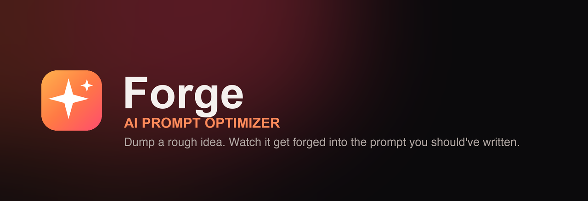
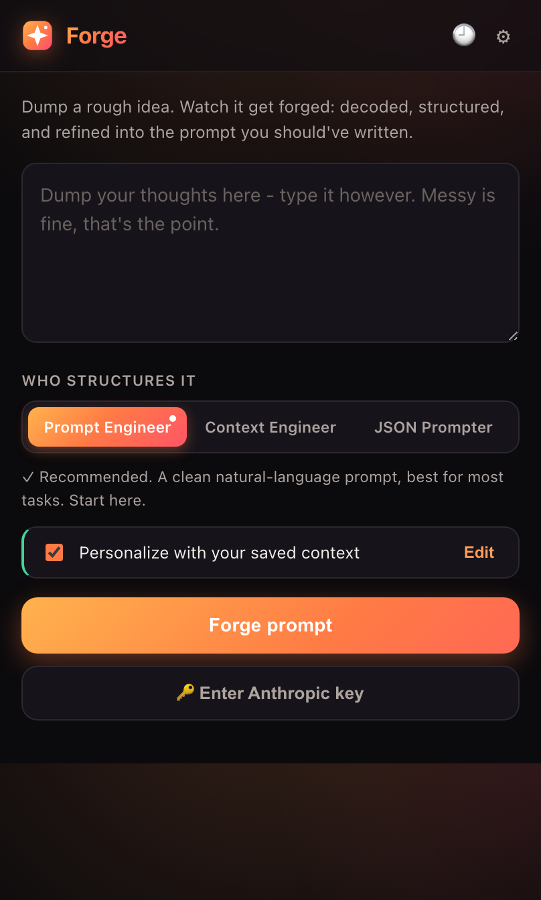
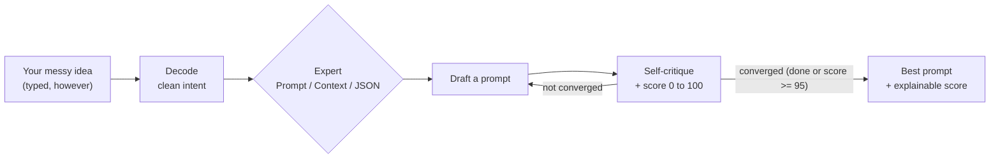

<p align="center">
  
</p>

<h1 align="center">Forge</h1>
<p align="center"><b>Dump a rough idea. Watch it get forged into the prompt you should've written.</b></p>

<p align="center">
  
  
  
  
</p>

---

**Forge** is a Chrome extension that kills prompt anxiety. You don't craft the perfect prompt; you type a messy, half-formed idea and Forge does the rest:

1. **Decodes** your gibberish into a clear statement of intent.
2. Hands it to an **expert** that structures it the right way.
3. Runs a visible **self-refining loop** that critiques and re-scores the prompt over several rounds, until it converges.

You get one tight, paste-ready prompt, an explainable quality score, and a clear view of exactly how it got there. It runs entirely on your own Anthropic API key, stored locally; no account, no server, nothing leaving your browser except the call to Anthropic.

<p align="center">
  
</p>

## Why Forge is different

Most prompt tools do one of two things: hand you a **template** from a library, or do a **one-shot rewrite**. Forge is the only one that **shows its work**. It decodes your intent first, then iterates in the open, scoring each round on four dimensions so the final number is earned, not a vibe. That transparent, self-improving loop is the core idea everything else is built around.

## How it works



- **Stage A, Decode:** one model call rewrites your raw input into clear intent, fixing typos and gibberish while preserving every requirement and adding nothing. Shown back to you as an editable "Understood intent".
- **Stage B, Structure and refine:** the chosen expert drafts a prompt, then critiques and improves it over 2 to 4 rounds. Each round is scored on **Clarity, Specificity, Structure, and Completeness**; the headline score is their average. The loop stops early once it converges.

Reliability comes from Anthropic **Structured Outputs**: each round's verdict is constrained to a JSON schema so it can't fail to parse, with a prompt-guided fallback if the API rejects the field.

## The three experts

| Expert | Output style | Best for |
|---|---|---|
| **Prompt Engineer** (recommended) | A clean, natural-language prompt | Most tasks. Start here. |
| **Context Engineer** | Labeled sections: Role, Context, Task, Constraints, Output | Complex or reusable prompts, agent system prompts |
| **JSON Prompter** | The prompt as a flat JSON object with enums | When code, an API, or a template will consume it |

Each expert's instructions encode best practices distilled from Anthropic, OpenAI, Google, and the context-engineering literature.

## Features

- **Type your intent however you like.** Messy is fine, that's the point.
- **Visible self-refining loop** with a clickable convergence strip (`R1 -> R2 -> R3`).
- **Explainable score:** Clarity / Specificity / Structure / Completeness bars; overall is their average.
- **Editable "Understood intent"** with a "Re-forge" that re-structures without re-decoding.
- **"What improved" trail** explaining what each round changed.
- **History:** every forge auto-saves; revisit, copy, re-forge, star, or delete (capped at 50, starred kept).
- **Reusable context memory:** save an "about you / your project" blurb once; toggle it per prompt.
- **Smart expert suggestion:** as you type, Forge nudges you toward the best-fitting expert.
- **Send to AI:** open the finished prompt straight into ChatGPT, Claude, or Gemini.
- **Inline button** on those sites: optimize what you typed without leaving the page.
- **Local first:** bring your own Anthropic key, stored in `chrome.storage.local`. No account, no middleman.

## Install (unpacked)

1. Open `chrome://extensions`.
2. Turn on **Developer mode** (top right).
3. Click **Load unpacked** and select this folder.
4. Pin Forge from the puzzle-piece menu.

## First run

1. Click the Forge icon. Open Settings via the gear or the **Enter Anthropic key** button.
2. Paste your Anthropic API key ([console.anthropic.com](https://console.anthropic.com/settings/keys)), pick a model (Sonnet is the default), and **Save**.
3. Pick an expert, type a rough idea, hit **Forge prompt**, watch it converge, then **Copy** or send it to your AI.

## Use it inside ChatGPT, Claude, and Gemini

With the extension installed, a floating **Forge** button appears on `chatgpt.com`, `claude.ai`, and `gemini.google.com`. Type a rough prompt in the chat box, click Forge, and it's replaced in place with the engineered version. The API call runs in a background worker so it isn't blocked by the site's content-security policy.

## Privacy and security

- Your API key is stored locally (`chrome.storage.local`, or `localStorage` when run as a plain web page). It is only ever sent to `api.anthropic.com`.
- No analytics, no telemetry, no backend. The only network request is the Claude API call you trigger.
- API usage is billed to your own Anthropic account. A forge is 3 to 5 calls (1 decode + 2 to 4 refine).

## Architecture

| File | Purpose |
|---|---|
| `manifest.json` | MV3 manifest: popup action, background worker, content scripts, permissions |
| `engine.js` | **Single source of truth** for the pipeline: prompts, personas, API call, parsing, the refine loop. Shared by the popup and the worker. |
| `popup.html` / `popup.css` / `popup.js` | The popup UI and orchestration (forge, settings, history) |
| `background.js` | Service worker that runs the pipeline for the inline button (off-page, past site CSP) |
| `content.js` / `content.css` | Injects the inline Forge button into the AI sites; reads and writes the chat composer |
| `make_icons.py` / `make_banner.py` | Regenerate the icons and the README banner |

The engine is pure (no DOM, no `chrome.*`); the popup loads it via `<script>` and the worker via `importScripts`, so the prompts and scoring can never drift between the two surfaces. It also falls back to `localStorage` so the whole thing runs as a plain web page on localhost, not just as an installed extension.

## Development

```bash
# regenerate icons (PNG 16 to 128) and the README banner
python3 make_icons.py
python3 make_banner.py

# run it as a local web page (popup only; inline button needs the installed extension)
python3 -m http.server 5599
# then open http://localhost:5599/popup.html
```

No build step: it's vanilla HTML, CSS, and JavaScript.

## Roadmap

- Target-model tuning (optimize per Claude / GPT / Gemini / image models)
- A starter prompt library and `{{variable}}` templates
- A keyboard shortcut to open and forge
- Chrome Web Store listing

## License

MIT. See [LICENSE](LICENSE).
